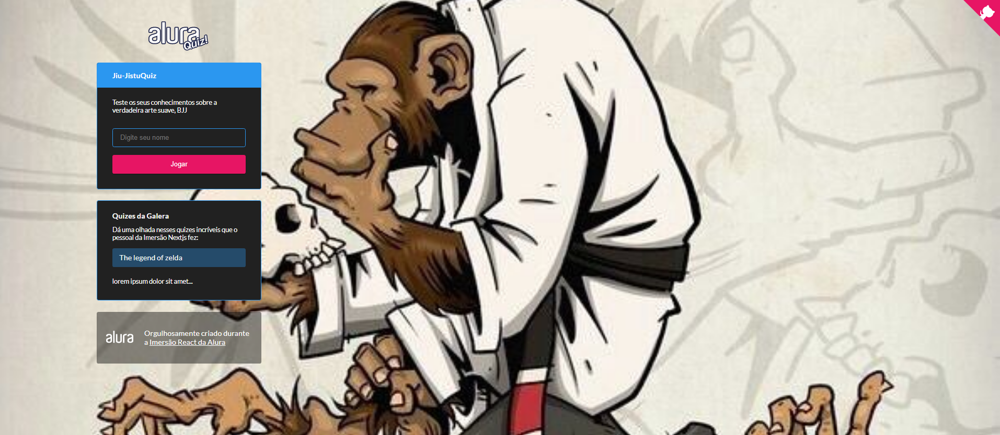

<h1 align="center">JIU-JITSU QUIZ</h1>

<h2 align="center">🍕🥋 Vamos ver se você conhece a verdadeira arte suave, BJJ!</h2>



## 💬 Sobre o projeto
Jiu Jitsu Quiz - É um projeto feito para testar seus conhecimentos na verdadeira arte suave BJJ, e desafiar seus amigos

Projeto desenvolvido durante a **IMERSÃO REACT NEXT.JS** oferecida pela [Alura](https://www.alura.com.br).

## Tecnologias utilizadas
* [Reactjs](https://pt-br.reactjs.org)
* [Nextjs](https://nextjs.org)
* [Typescript](https://www.typescriptlang.org/)
* [Nodejs](https://nodejs.org/en/)
* [Styled Components](https://styled-components.com/)

## 🚀 Como executar o projeto

- Antes de começar, você vai precisar ter instalado em sua máquina as seguintes ferramentas: [Git](https://git-scm.com), [Node.js](https://nodejs.org/en/). 
- E um editor para trabalhar com o código como [VSCode](https://code.visualstudio.com/).
- Instale **[Yarn](https://yarnpkg.com/)** para ter uma melhor experiência quando for executar a aplicação.

### :octocat: Faça o clone do projeto

```bash
# Clone este repositório
$ git clone <https://github.com/Gilles30/jiujitsuquiz.git>

# Acesse a pasta do projeto no terminal/cmd
$ cd jiujitsuquiz

```


### 💻 Rodando a aplicação web
```bash

# Instale as dependências
$ yarn install

# Execute a aplicação 
$ yarn dev

# O aplicação inciará (geralmente) na porta:3000 - acesse <http://localhost:3000>
```


## 👨🏻‍🚀 Sobre mim
<a href="https://www.linkedin.com/in/lorison-gilles/">
 
 <p>Lorison Gilles</p>
</a>
<br>
## 💜💙💙  Agradecimentos
Valew[Alura](https://www.alura.com.br) por estar ajudando a comunidade sempre, Tmj🚀.
